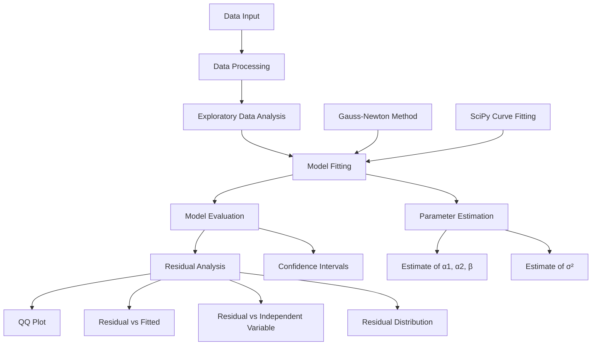

# Non-Linear Regression Analysis

This repository contains analysis and implementation of non-linear regression models for time series data. The project focuses on fitting and analyzing exponential models of the form:

$$y(t) = \alpha_1 + \alpha_2e^{\beta t} + \epsilon(t)$$

and 

$$y(t) = \alpha_1 e^{\beta_1 t} + \alpha_2 e^{\beta_2 t} + \epsilon(t)$$

Where $\epsilon(t)$ represents random error terms that are assumed to be independent and identically distributed normal random variables with zero mean and finite variance.

## Project Overview

This project demonstrates the application of statistical methods for non-linear regression, with a focus on:

1. Fitting exponential models to time series data
2. Implementing the Gauss-Newton method for parameter estimation
3. Analyzing residuals and validating model assumptions
4. Comparing different optimization approaches

## Project Structure

## Dataset

The data is provided in `data-39.txt` in the format of $(t, y(t))$ pairs, representing time series observations.

## Analysis Steps

The analysis follows these key steps:

1. **Data Visualization**: Plotting the raw data to understand patterns
2. **Residual Analysis**: Plotting the residual sum of squares as a function of β
3. **Parameter Estimation**: Using the Gauss-Newton method for finding least squares estimates
4. **Error Variance**: Estimating σ²
5. **Confidence Intervals**: Computing intervals based on the Fisher information matrix
6. **Model Validation**: Analyzing residuals through various diagnostic plots
7. **Normality Testing**: Assessing if residuals satisfy normality assumptions
8. **Comparison**: Using alternative optimization methods (SciPy's curve_fit) 
9. **Extended Model**: Fitting a more complex model with two exponential terms

## Implementation Details

The core analysis is implemented in a Jupyter notebook (`regression_analysis.ipynb`) using:
- Python for numerical computation
- NumPy for vector operations
- Pandas for data management
- Matplotlib for visualization
- StatsModels for statistical analysis
- SciPy for optimization

## Key Functions

- `gauss_newton()`: Implementation of the Gauss-Newton algorithm for non-linear regression
- `get_residual()`: Calculation of residual sum of squares
- Various statistical tests and visualization functions for model validation

## Results

The analysis includes:
- Parameter estimates for different models
- Confidence intervals
- Diagnostic plots
- Comparison of different optimization approaches
- Validation of model assumptions

## Requirements

- Python 3.x
- NumPy
- Pandas
- Matplotlib
- StatsModels
- SciPy